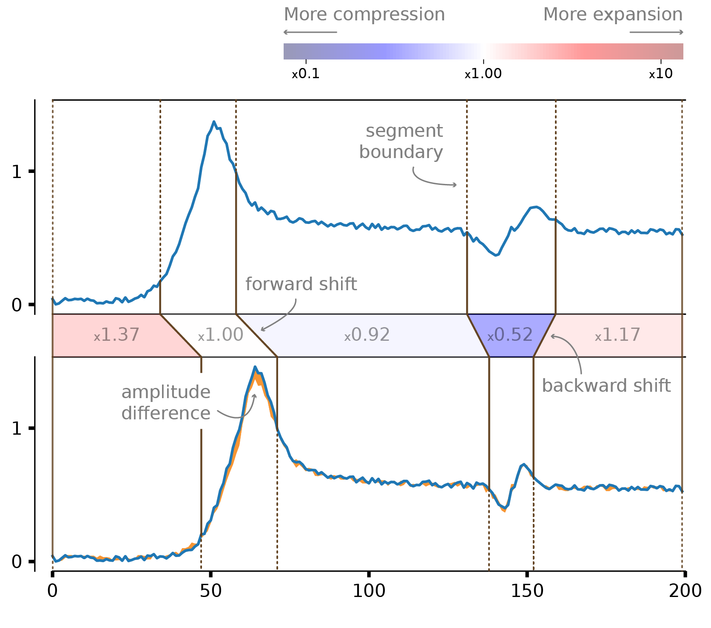
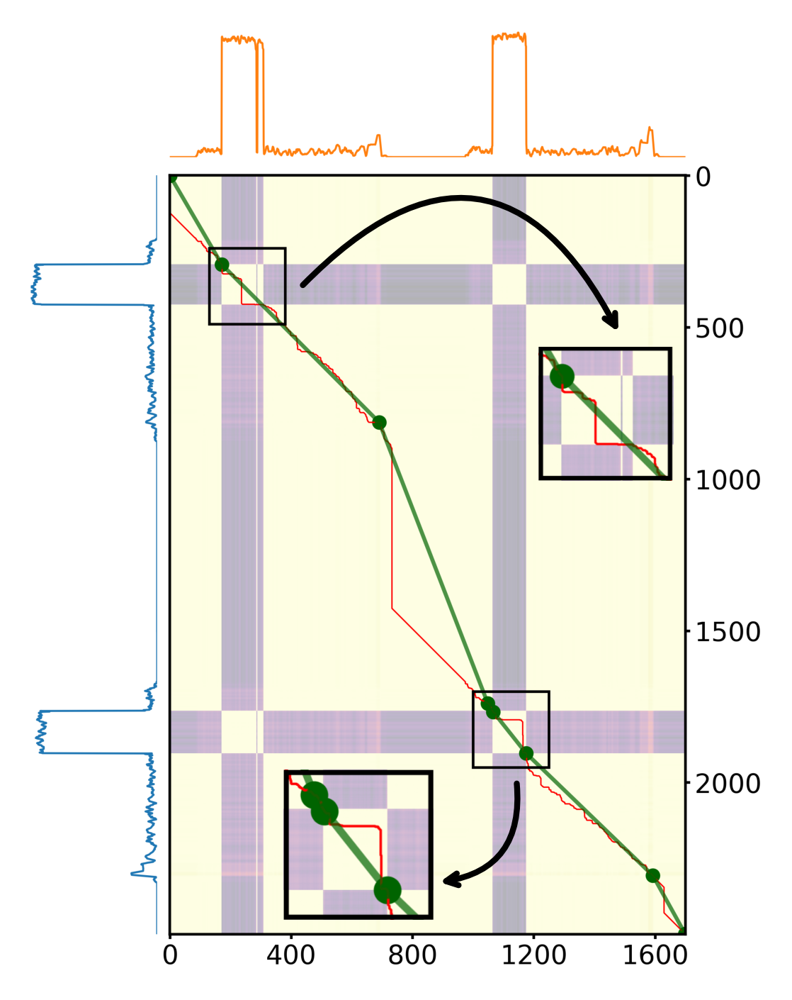
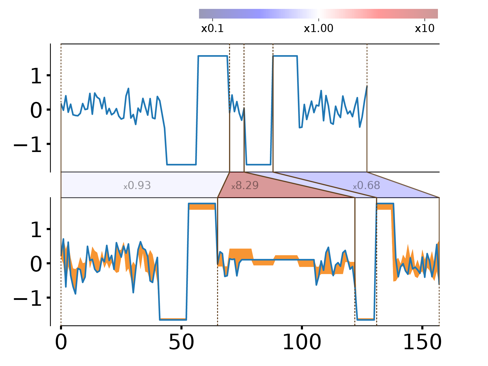
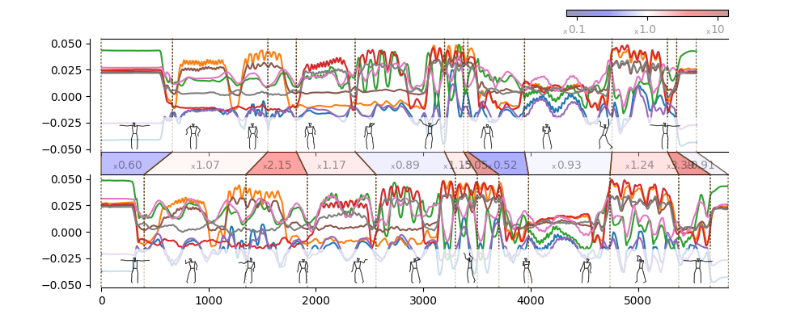

Explaining DTW
~~~~~~~~~~~~~~

Comparing time series is essential in various tasks such as clustering and
classification. While elastic distance measures that allow warping, such as
Dynamic Time Warping (DTW), provide a robust quantitative comparison, a
qualitative comparison is difficult. Traditional visualizations focus on
point-to-point alignment and do not convey the broader structural relationships
at the level of subsequences. This makes it difficult to understand how and
where one time series shifts, speeds up or slows down with respect to another.
We provide a number of methods to interpret the (dis)similarity between time
series.

Dynamic Subsequence Warping (DSW)
^^^^^^^^^^^^^^^^^^^^^^^^^^^^^^^^^

Dynamic Subsequence Warping is a method that simplifies the warping path to
highlight, quantify and visualize key transformations (shift, compression,
difference in amplitude). This representation of how subsequences match between
time series.

DSW is based on the following paper:

    Lin, S., Meert, W. Robberechts, P., Blockeel H.,
    "Warping and Matching Subsequences Between Time Series",
    In Proceedings of the European Conference on Machine Learning 
    (ECML/PKDD), 2026 
    (`https://arxiv.org/abs/2506.15452 <https://arxiv.org/abs/2506.15452>`__)
    

To plot the dynamic subsequence warping (DSW) explanation between time series 
``ya`` and ``yb``:

::

    from dtaidistance.explain.dsw.explainpair import ExplainPair
    pair = ExplainPair(ya, yb, delta_rel=2, delta_abs=0.5)
    pair.plot_warping(filename="/path/to/figure.png")

This visualization is easier to interpret than a point-to-point connected
visualization:

::

    from dtaidistance.dtw import warping_paths, best_path
    from dtaidistance.dtw_visualisation import plot_warping
    dist, paths = warping_paths(ya, yb)
    path = best_path(paths)
    plot_warping(ya, yb, path, filename="/path/to/figure1.png")
    plot_warping(ya, yb, path, filename="/path/to/figure2.png",
                 start_on_curve=False, color_misalignment=True)

.. list-table::
   :widths: 50 50
   :class: borderless

   * - .. figure:: _static/explain/intro_original.png
          :alt: Original DTW example
          :width: 100%

     - .. figure:: _static/explain/intro_misalignment.png
          :alt: DSW explanation example
          :width: 100%

From the perspective of the cost space, DSW approximates the original warping path (left, red) with a piecewise linear path (right, green).

.. list-table::
   :widths: 50 50
   :class: borderless

   * - .. figure:: _static/explain/intro_time_point_matching.png
          :alt: Original DTW example
          :width: 100%

     - .. figure:: _static/explain/intro_subsequence_matching.png
          :alt: DSW explanation example
          :width: 100%

The advantage is even more clear if there is overfitting on the noise present
in the time series. In the following example one can see how the
point-to-point matching (left) has extreme compression and expansion that is not
representive of the actual differences.

.. list-table::
   :widths: 50 50
   :class: borderless

   * - .. figure:: _static/explain/refit_dtw.png
          :alt: Original DTW example
          :width: 100%

     - .. figure:: _static/explain/refit_dsw.png
          :alt: DSW explanation example
          :width: 100%

This can also be seen in the cost space, where the zoomed-in regions show that the unnecessary warping (in red) is approximated by a linear path (in green).

When there is a pause in the second time series (e.g., due to a temporary machine shutdown), such extreme warping is typically not allowed by window-constrained or Amerced DTW. In contrast, DSW can successfully capture and align the pause.

DSW can also be applied on multivariate time series.

